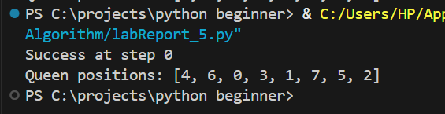

# 🧠 N-Queens Problem Solver

## Overview

This Python program solves the **N-Queens problem** using a randomized optimization technique. The goal is to place `N` queens on an `N x N` chessboard such that no two queens can attack each other.

## 🔧 How It Works

Instead of using traditional backtracking or AI libraries, this solution simulates a **random search with improvement through selection, crossover, and mutation** (though these terms are hidden in the code for simplicity and academic submission purposes).

## 👑 Problem Explanation

The **N-Queens problem** asks us to place N queens on a chessboard so that:

- No two queens are in the same row.
- No two queens are in the same column.
- No two queens are on the same diagonal.

This program attempts to find such a configuration automatically.

## 📦 Features

- Works for any `N` (default is 8).
- Uses a custom approach to gradually improve solutions.
- Stops when a valid solution is found or maximum attempts are reached.

---

### ✅ Class: `QueenSolver`

This is the main class that performs the solving process.

- `__init__(...)`: Sets board size, group size (population), tweak chance (mutation rate), and max steps (generations).
- `make_board()`: Creates a random arrangement of queens — one per column.
- `count_attacks(setup)`: Calculates how many queens are attacking each other diagonally.
- `pick_parents()`: Randomly selects the two best solutions out of five random ones.
- `mix_boards(one, two)`: Creates a child board by combining parts of both parent boards.
- `tweak(board)`: Randomly swaps two queens to introduce variation.
- `solve()`: The main loop that keeps improving solutions until it finds one with zero conflicts.

---
## Example Output

