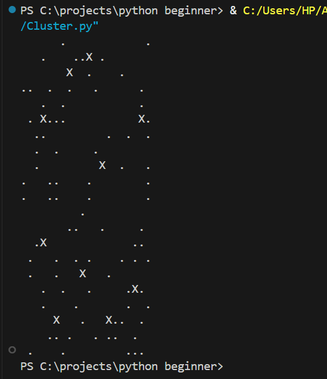

# 🧪 Modified K-Means Clustering with Manhattan Distance

## Objective

The goal of this lab is to implement a modified version of the K-Means clustering algorithm using the Manhattan distance metric instead of Euclidean distance.  
Additionally, the algorithm must generate random points and cluster centers, and display the clustering result on a 2D grid using only the `print()` function.

---

## Tasks Completed

- Generated 100 random 2D points and 10 random initial cluster centers within a 20x20 grid.
- Saved the generated points and centers into a CSV file (`data.csv`).
- Implemented a custom K-Means clustering algorithm using Manhattan distance.
- Updated cluster centers based on the mean position of assigned points.
- Displayed the final clusters using a simple text-based visualization (`X` for centers, `.` for points).

---

## Key Concepts Used

- **Manhattan Distance:**  
  Distance = |x1 - x2| + |y1 - y2|

- **K-Means Clustering:**  
  Assign points to the nearest center, update center positions, repeat until convergence.

- **2D Matrix Visualization:**  
  A 20x20 grid was created to represent the Cartesian plane, and printed using `print()`.

---

## How the Code Works

1. **Data Generation:**
   - 100 random points and 10 random cluster centers are generated.
   - Both are saved into a CSV file with labels (`point`, `center`).

2. **Clustering Process:**
   - For each point, the Manhattan distance to every center is calculated.
   - Points are assigned to their nearest center.
   - Centers are updated based on the average x and y of their assigned points.
   - The process repeats until the assignments no longer change (or after 100 iterations).

3. **Visualization:**
   - A 20x20 grid is initialized with spaces.
   - Data points are marked with `.` and cluster centers with `X`.
   - The entire grid is printed row by row to the console.

---

## Example Output

